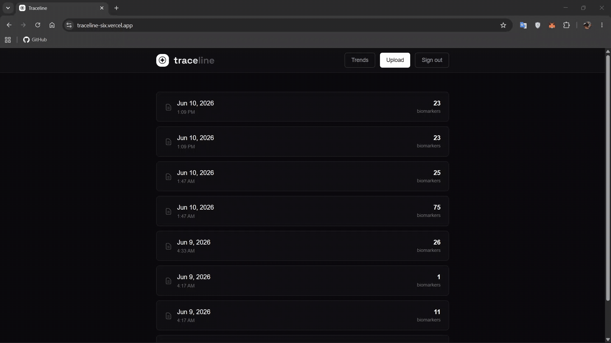
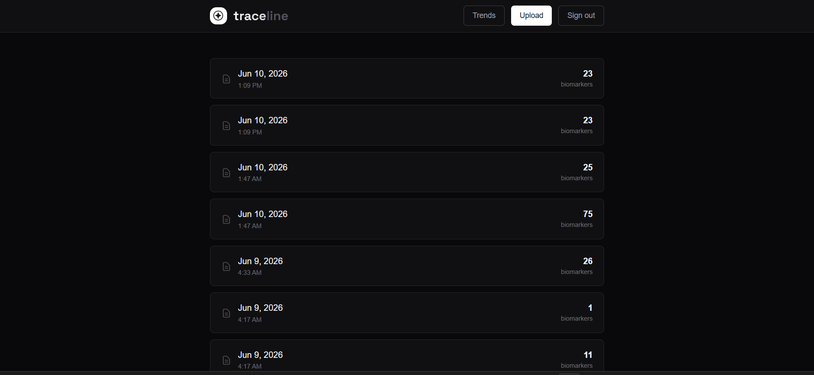
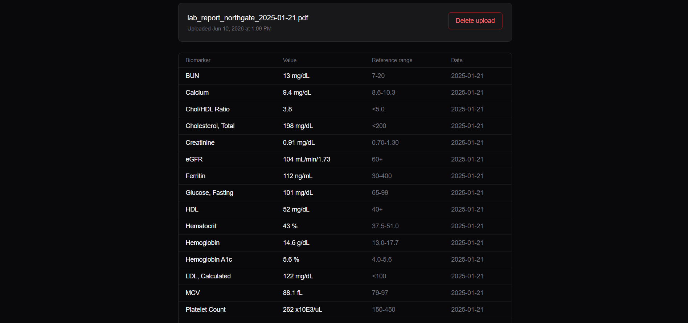

# Traceline

Upload a blood test PDF from any lab, whether it's Quest, LabCorp, or a hospital portal. Claude reads it and extracts every biomarker: name, value, unit, reference range, date. Each new report adds to your history, so instead of a folder of random PDFs you get a timeline of how your bloodwork has actually moved.

---

## Demo

<table>
  <tr>
    <td rowspan="2"></td>
    <td></td>
  </tr>
  <tr>
    <td></td>
  </tr>
</table>

*(Live demo: coming soon)*

---

## Examples

Questions Traceline is built to answer:

- How has my ferritin changed during marathon training?
- How has my A1C moved since I started losing weight?
- What happened to my cholesterol after I changed my diet?
- How have my thyroid markers trended over the last two years?

---

## Why It's Interesting

Most "chat with your documents" tools chunk up text and embed it for semantic search. You ask a question, it finds a relevant chunk, and an LLM summarizes it. That works fine for finding one fact in one document.

Traceline takes a different approach. Each lab report goes to Claude as a PDF and comes back as structured rows, one per biomarker, with a value, unit, and date. No chunking, no embeddings, no retrieval step.

That gives you a dataset you can query, not an archive you can search. A ferritin value from a 2022 report and one from a 2026 report land in the same table as two comparable rows. So "ferritin over 18 months" isn't a document search problem anymore. It's a SQL query and a line chart.

---

## Architecture

```
PDF upload
    ↓
Claude Document API  →  structured JSON
    ↓
Zod validation (per biomarker)
    ↓
Postgres (Supabase)
    ↓
Trend charts (Recharts)
```

---

## Built With

- Next.js (App Router)
- TypeScript
- Supabase (Postgres + auth)
- Claude API
- Tailwind CSS
- Recharts
- Vercel

---

## Future Work

- Natural language querying ("how's my cholesterol trending?")
- Automated trend analysis and flags
- Training/fitness data integrations
- More health analytics

---

## Running Locally

### 1. Clone and install

```bash
git clone https://github.com/Ruchiraangad/Traceline.git
cd Traceline
npm install
```

### 2. Set up Supabase

Create a project at [supabase.com](https://supabase.com), then run in the SQL editor:

```sql
create table uploads (
  id uuid primary key default gen_random_uuid(),
  user_id uuid references auth.users(id) on delete cascade,
  filename text not null,
  uploaded_at timestamptz default now()
);

create table biomarkers (
  id uuid primary key default gen_random_uuid(),
  user_id uuid references auth.users(id) on delete cascade,
  upload_id uuid references uploads(id) on delete cascade,
  biomarker text not null,
  value numeric not null,
  unit text not null,
  reference_range text,
  tested_at date,
  created_at timestamptz default now()
);

alter table uploads enable row level security;
alter table biomarkers enable row level security;

create policy "users can only access their own uploads"
on uploads for all using (auth.uid() = user_id);

create policy "users can only access their own biomarkers"
on biomarkers for all using (auth.uid() = user_id);
```

For local testing, disable **Confirm email** under Authentication → Providers → Email.

### 3. Environment variables

Create `.env.local`:

```
NEXT_PUBLIC_SUPABASE_URL=your_supabase_project_url
NEXT_PUBLIC_SUPABASE_ANON_KEY=your_supabase_anon_key
ANTHROPIC_API_KEY=your_anthropic_api_key
```

Supabase keys: **Settings → API**. Anthropic key: [console.anthropic.com](https://console.anthropic.com).

### 4. Run

```bash
npm run dev
```

Open [http://localhost:3000](http://localhost:3000).
